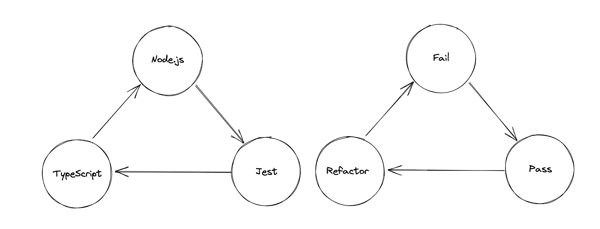

# typescript-jest-template



This is a template for quickly implementing ideas in a TDD fashion.

## Motivation

Sometimes I want to write something that comes in my mind, but I don't want to spend time on setting up the environment. This template is for that purpose.

## Usage

Just use this template to create a new repository.

After creating the repository, clone it to your local machine. Then, install the dependencies.

```bash
$ yarn
```

After that, you can start writing your code. The source codes are in `src` directory. The test codes are in `__tests__` directory.

If you want to run the tests, run the following command.

```bash
$ yarn test
```

If you want to build the source codes, run the following command.

```bash
$ yarn build
```

If you want to directly run typescript code, run the following command.

```bash
$ npx ts-node src/<your-file>.ts
```

Enjoy!

## License

This repository is licensed under the MIT license. See [LICENSE](LICENSE) for details.
